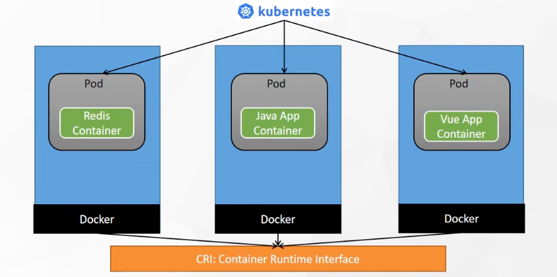
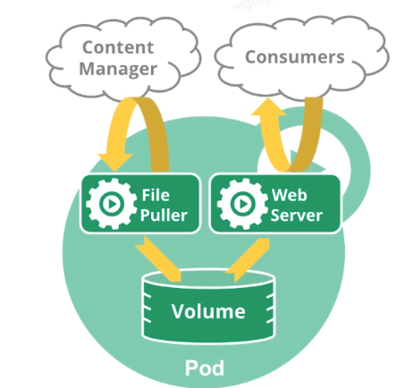
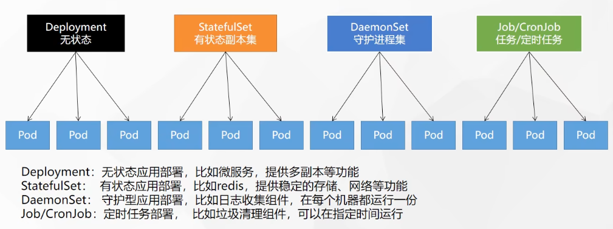
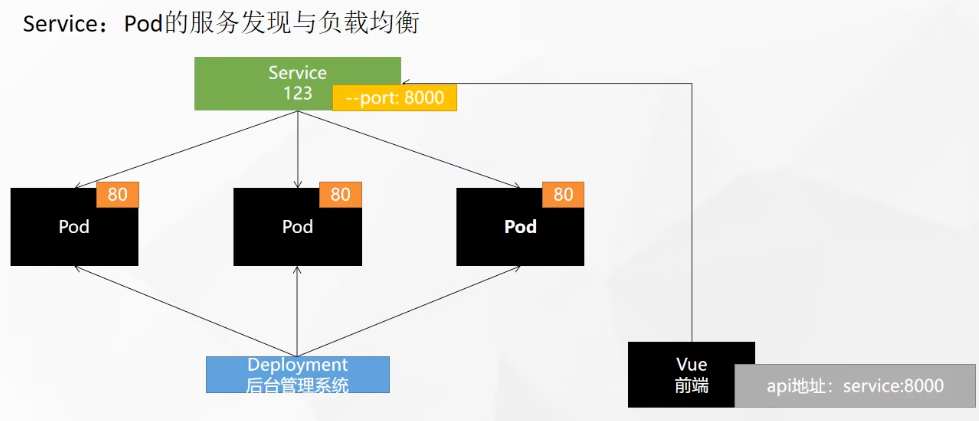
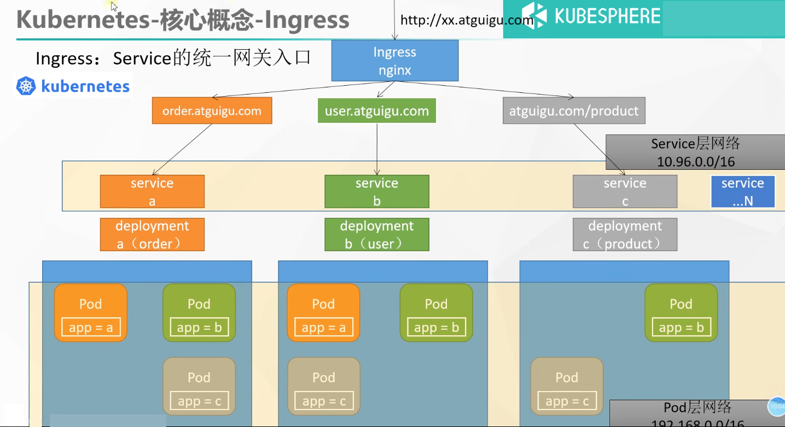

# 1、资源创建方式
+ 命令行
+ YAML 
+ kubernetes-dashboard


# 2、Namespace
> 名称空间用来隔离资源
>
> k8s自带几个namespace：
>
> ```sh
> > kubectl get ns
> NAME                   STATUS   AGE
> default                Active   127m
> kube-node-lease        Active   127m
> kube-public            Active   127m
> kube-system            Active   127m
> kubernetes-dashboard   Active   35m
> 
> # 查看pods也会写清楚pods所在的namespace
> > kubectl get pods -A
> NAMESPACE              NAME                                         READY   STATUS    RESTARTS   AGE
> kube-system            calico-kube-controllers-bcc6f659f-pj8gj      1/1     Running   0          53m
> kube-system            calico-node-ww44h                            1/1     Running   0          53m
> kube-system            coredns-5897cd56c4-dprc5                     1/1     Running   0          128m
> kube-system            coredns-5897cd56c4-r6fxw                     1/1     Running   0          128m
> kube-system            etcd-hahhome                                 1/1     Running   0          128m
> kube-system            kube-apiserver-hahhome                       1/1     Running   0          128m
> kube-system            kube-controller-manager-hahhome              1/1     Running   0          128m
> kube-system            kube-proxy-qt4tc                             1/1     Running   0          128m
> kube-system            kube-scheduler-hahhome                       1/1     Running   0          128m
> kubernetes-dashboard   dashboard-metrics-scraper-79c5968bdc-mf9bn   1/1     Running   0          36m
> kubernetes-dashboard   kubernetes-dashboard-658485d5c7-t7gwt        1/1     Running   0          36m
> 
> # 获取默认namespace下的pod（什么都不指定）
> > kubectl get pods
> 
> # 只获取指定namespace下的pod
> > kubectl get pods -n kubernetes-dashboard
> NAME                                         READY   STATUS    RESTARTS   AGE
> dashboard-metrics-scraper-79c5968bdc-mf9bn   1/1     Running   0          39m
> kubernetes-dashboard-658485d5c7-t7gwt        1/1     Running   0          39m
> ```

命令行方式：

```bash
kubectl create ns hello
kubectl delete ns hello
```

yaml方式：

```yaml
apiVersion: v1
kind: Namespace
metadata:
  name: hello
```

```sh
kubectl apply -f hello.yaml
kubectl delete -f hello.yaml
```


# 3、Pod

>  Pod是运行中的**一组容器（一个或多个）**，Pod是kubernetes中应用的最小单位.





> 默认不允许在master节点上运行pod，如果是单节点集群测试，可以去除master节点的污点，就可以在master运行pod：
>
> ```sh
> kubectl taint nodes --all node-role.kubernetes.io/master-
> ```

kubectl run的时候，先由master接受到指令，然后到调度器里检查node资源，然后返回某个合适的node节点，apiServer就会通知该node的kubelet开始进行部署

```bash
## pod 基本操作

# 启动一个pod（默认创建在default namespace）,会随机分配集群中的一个节点运行pod
kubectl run mynginx --image=nginx

# 查看default名称空间的Pod
kubectl get pod [-n namespace]
# 描述
kubectl describe pod 你自己的Pod名字 [-n namespace]
# 删除
kubectl delete pod Pod名字 [-n namespace]
# 查看Pod的运行日志
kubectl logs Pod名字

# 打印pod的更完善信息：每个Pod，k8s都会分配一个ip
kubectl get pod -owide
# 使用Pod的ip+pod里面运行容器的端口
curl 192.168.169.136

# 集群中的任意一个机器以及任意的应用都能通过Pod分配的ip来访问这个Pod

# 进入pod内部（与docker的区别是多了个 "--"）
kubectl exec -it mynginx -- /bin/bash
```

```yaml
apiVersion: v1
kind: Pod
metadata:
  labels:
    run: mynginx
  name: mynginx
#  namespace: default
spec:
  containers:
  - image: nginx
    name: mynginx
```


一个pod启动多个container：

同一个pod的 containers 共享网络空间和存储

```yaml
apiVersion: v1
kind: Pod
metadata:
  labels:
    run: myapp
  name: myapp
spec:
  containers:
  - image: nginx
    name: nginx
  - image: tomcat:8.5.68
    name: tomcat
```

> 也可以使用可视化界面（kubernetes-dashboard）创建 pod

_**此时的应用还不能外部访问**_

```sh
# 打印pod的更完善信息：每个Pod，k8s都会分配一个ip
kubectl get pod -owide
# 使用Pod的ip+pod里面运行容器的端口
curl 192.168.169.136
```


# 4、Deployment
> 控制Pod，使Pod拥有多副本，自愈，扩缩容等能力
>

```bash
# 清除所有Pod，比较下面两个命令有何不同效果？
kubectl run mynginx --image=nginx

kubectl create deployment mytomcat --image=tomcat:8.5.68
# 此命令启动的pod拥有 自愈能力
# 删除此pod模拟程序挂掉，发现k8s会自动再次启动该pod

# 查看deploy
kubectl get deploy
# 要真的删除该pod，需要指明删除的是deploy而不是pod
kubectl delete deploy mytomcat
```


## 1、多副本
```bash
kubectl create deployment my-dep --image=nginx --replicas=3
```

```yaml
apiVersion: apps/v1
kind: Deployment
metadata:
  labels:
    app: my-dep
  name: my-dep
spec:
  replicas: 3
  selector:
    matchLabels:
      app: my-dep
  template:
    metadata:
      labels:
        app: my-dep
    spec:
      containers:
      - image: nginx
        name: nginx
```


## 2、扩缩容
```bash
kubectl scale --replicas=5 deployment/my-dep
```

```bash
kubectl edit deployment my-dep

#修改yaml文件去修改 replicas
```


## 3、自愈&故障转移
+ 停机 --> 故障转移：将宕机中的pod运行到其他机器
+ 删除Pod --> 自愈：自动重新启动一个pod
+ 容器崩溃 --> 自愈：自动重新启动容器
+ ....


## 4、滚动更新

> 滚动更新：对deploy其中一个pod，先启动pod-v2，再停止这个pod-v1；成功后再进行到下一个pod

```bash
kubectl set image deployment/my-dep tomcat=tomcat:latest --record
kubectl rollout status deployment/my-dep
```


```yaml
# 修改 kubectl edit deployment/my-dep
```


## 5、版本回退

> 版本回退也是一个滚动更新的过程

```bash
#历史记录
kubectl rollout history deployment/my-dep

#查看某个历史详情
kubectl rollout history deployment/my-dep --revision=2


#回滚(回到上次)
kubectl rollout undo deployment/my-dep

#回滚(回到指定版本)
kubectl rollout undo deployment/my-dep --to-revision=2
```


## 6、更多工作负载

> 更多工作负载：
>
> 除了Deployment，k8s还有 `StatefulSet` 、`DaemonSet` 、`Job`  等 类型资源。我们都称为 `工作负载`。
>
> 有状态应用使用  `StatefulSet`  部署，无状态应用使用 `Deployment` 部署
>
> [https://kubernetes.io/zh/docs/concepts/workloads/controllers/](https://kubernetes.io/zh/docs/concepts/workloads/controllers/)
>
> 


# 5、Service
> <font style="color:rgb(34, 34, 34);">将一组 </font>[Pods](https://kubernetes.io/docs/concepts/workloads/pods/pod-overview/)<font style="color:rgb(34, 34, 34);"> 公开为网络服务的抽象方法。</font>
>
> 之前通过 kubectl get pods -owide 获取pod私有ip的访问方式，只能访问到单个pod，而没办法进行负载均衡等
>
> 通过将一组pod组合成一个service，可以通过serivce统一对外暴露进行服务发现与负载均衡
>
> 

```bash
#暴露Deploy --port为service对外暴露的端口
kubectl expose deployment my-dep --port=8000 --target-port=80

#使用标签检索Pod
kubectl get pod -l app=my-dep
```

```yaml
apiVersion: v1
kind: Service
metadata:
  labels:
    app: my-dep
  name: my-dep
spec:
  selector:
    app: my-dep
  ports:
  - port: 8000
    protocol: TCP
    targetPort: 80
```


## 1、ClusterIP

> ClusterIP模式暴露出来的ip只能在**集群内**访问，不能对外访问
>
> ```sh
> # 查看服务ClusterIP，会打印service ClusterIP
> > kubectl get service
> NAME         TYPE        CLUSTER-IP    EXTERNAL-IP   PORT(S)    AGE
> kubernetes   ClusterIP   10.96.0.1     <none>        443/TCP    4d4h
> my-dep       ClusterIP   10.96.47.23   <none>        8000/TCP   3s
> ```
>
> 访问方式：
>
> 1. serviceClusterIP:port
> 2. 在pod内部：服务名.名称空间名.svc:port

```bash
# 等同于没有--type的
kubectl expose deployment my-dep --port=8000 --target-port=80 --type=ClusterIP
```

```yaml
apiVersion: v1
kind: Service
metadata:
  labels:
    app: my-dep
  name: my-dep
spec:
  ports:
  - port: 8000
    protocol: TCP
    targetPort: 80
  selector:
    app: my-dep
  type: ClusterIP
```

## 2、NodePort

> NodePort模式可以在集群外访问，相比ClsuterIP，多暴露一个公网随机端口，支持集群内和集群外访问
>
> ```sh
> # 查看服务ClusterIP，会打印serviceClusterIP 和 对外随机端口
> > kubectl get service
> NAME         TYPE        CLUSTER-IP      EXTERNAL-IP   PORT(S)          AGE
> kubernetes   ClusterIP   10.96.0.1       <none>        443/TCP          4d4h
> my-dep       NodePort    10.96.248.129   <none>        8000:32363/TCP   4m13s
> ```
>
> 访问方式：
>
> 1. 集群内访问：和ClusterIP模式的方法一致
> 2. 集群外访问：通过任意一台机器的公网IP:随机对外端口 （这里是32363）

```bash
kubectl expose deployment my-dep --port=8000 --target-port=80 --type=NodePort
```

```yaml
apiVersion: v1
kind: Service
metadata:
  labels:
    app: my-dep
  name: my-dep
spec:
  ports:
  - port: 8000
    protocol: TCP
    targetPort: 80
  selector:
    app: my-dep
  type: NodePort
```

> NodePort范围在 30000-32767 之间
>

# 6、Ingress

> Service 是一组pod的入口，与Deploy是一一对应的关系，代表一个服务
>
> 而Ingress是**一组Service的入口**，如下图，用于将不同的请求转发到不同的服务（service）进行处理



## 1、安装
```bash
wget https://raw.githubusercontent.com/kubernetes/ingress-nginx/controller-v0.47.0/deploy/static/provider/baremetal/deploy.yaml

#修改镜像
vi deploy.yaml
#将image的值改为如下值：
registry.cn-hangzhou.aliyuncs.com/lfy_k8s_images/ingress-nginx-controller:v0.46.0

# 安装ingress
kubectl apply -f deploy.yaml

# 检查安装的结果
kubectl get pod,svc -n ingress-nginx

# 最后别忘记把svc暴露的端口要放行
```


> ```sh
> > kubectl get svc -n ingress-nginx
> NAME                                 TYPE        CLUSTER-IP      EXTERNAL-IP   PORT(S)                      AGE
> ingress-nginx-controller             NodePort    10.96.46.17     <none>        80:31640/TCP,443:32275/TCP   4m43s
> ingress-nginx-controller-admission   ClusterIP   10.96.119.249   <none>        443/TCP                      4m43s
> ```
>
> 如上 ingress-nginx-controller 这个service对外暴露的两个端口：这里是 31640 和  32275 记得在安全组放行


## 2、使用
> 官网地址：[https://kubernetes.github.io/ingress-nginx/](https://kubernetes.github.io/ingress-nginx/)
>
> ingress网关就是由nginx实现的
>
> 下面只挑选其中的 **路径重写** 和 **流量限制** 进行讲解，其他请参考官方文档


> http://139.198.163.211:31640/
>
> https://139.198.163.211:32275/

### 测试环境
> 应用如下yaml，准备好测试环境
>

```yaml
apiVersion: apps/v1
kind: Deployment
metadata:
  name: hello-server
spec:
  replicas: 2
  selector:
    matchLabels:
      app: hello-server
  template:
    metadata:
      labels:
        app: hello-server
    spec:
      containers:
      - name: hello-server
        image: registry.cn-hangzhou.aliyuncs.com/lfy_k8s_images/hello-server
        ports:
        - containerPort: 9000
---
apiVersion: apps/v1
kind: Deployment
metadata:
  labels:
    app: nginx-demo
  name: nginx-demo
spec:
  replicas: 2
  selector:
    matchLabels:
      app: nginx-demo
  template:
    metadata:
      labels:
        app: nginx-demo
    spec:
      containers:
      - image: nginx
        name: nginx
---
apiVersion: v1
kind: Service
metadata:
  labels:
    app: nginx-demo
  name: nginx-demo
spec:
  selector:
    app: nginx-demo
  ports:
  - port: 8000
    protocol: TCP
    targetPort: 80
---
apiVersion: v1
kind: Service
metadata:
  labels:
    app: hello-server
  name: hello-server
spec:
  selector:
    app: hello-server
  ports:
  - port: 8000
    protocol: TCP
    targetPort: 9000
```


### 1、域名访问
```yaml
apiVersion: networking.k8s.io/v1
kind: Ingress  
metadata:
  name: ingress-host-bar
spec:
  ingressClassName: nginx
  rules:
  - host: "hello.atguigu.com"
    http:
      paths:
      - pathType: Prefix
        path: "/"
        backend:
          service:
            name: hello-server
            port:
              number: 8000
  - host: "demo.atguigu.com"
    http:
      paths:
      - pathType: Prefix
        path: "/nginx"  # 把请求会转给下面的服务，下面的服务一定要能处理这个路径，不能处理就是404
        backend:
          service:
            name: nginx-demo  ## java，比如使用路径重写，去掉前缀nginx
            port:
              number: 8000
```

```sh
kubectl apply -f ingress.yaml

# 查看当前应用的 ingress 规则
kubectl get ing

# 修改某个ingress规则
kubectl edit ing <ing_name>
```


> 问题： path: "/nginx" 与  path: "/" 为什么会有不同的效果？
>
> 一个是ingress的nginx，一个是pod部署的nginx


### 2、路径重写
```yaml
apiVersion: networking.k8s.io/v1
kind: Ingress  
metadata:
  annotations:
    nginx.ingress.kubernetes.io/rewrite-target: /$2
  name: ingress-host-bar
spec:
  ingressClassName: nginx
  rules:
  - host: "hello.atguigu.com"
    http:
      paths:
      - pathType: Prefix
        path: "/"
        backend:
          service:
            name: hello-server
            port:
              number: 8000
  - host: "demo.atguigu.com"
    http:
      paths:
      - pathType: Prefix
        path: "/nginx(/|$)(.*)"  # 把请求会转给下面的服务，下面的服务一定要能处理这个路径，不能处理就是404
        backend:
          service:
            name: nginx-demo  ## java，比如使用路径重写，去掉前缀nginx
            port:
              number: 8000
```

> 变化的部分：
>
> - 添加了annotations: nginx.ingress.kubernetes.io/rewrite-target: /$2
> - 修改了path: "/nginx(/|$)(.*)"
>
> 作用是，将 `/nginx/*`  重写为 `/*`


### 3、流量限制

```yaml
apiVersion: networking.k8s.io/v1
kind: Ingress
metadata:
  name: ingress-limit-rate
  annotations:
    nginx.ingress.kubernetes.io/limit-rps: "1"
spec:
  ingressClassName: nginx
  rules:
  - host: "haha.atguigu.com"
    http:
      paths:
      - pathType: Exact
        path: "/"
        backend:
          service:
            name: nginx-demo
            port:
              number: 8000
```


### 4、更多高级用法

> 官方文档：[https://kubernetes.github.io/ingress-nginx/](https://kubernetes.github.io/ingress-nginx/)
>
> 下面只挑选其中的 **路径重写** 和 **流量限制** 进行讲解，其他请参考官方文档


# 7、存储抽象

> 如果一个pod挂掉后，k8s将其重启到另一台机器，那么其之前产生的文件就丢失了
>
> 那么就需要**统一管理存储**
>
> 存储层的实现有很多可选项，k8s支持多种存储层实现：
>
> - NFS （这里我们选这个）
> - Glusterfs
> - CephFS

## 环境准备
### 1、所有节点
```bash
#所有机器安装
yum install -y nfs-utils
```

### 2、主节点
```bash
#nfs主节点
echo "/nfs/data/ *(insecure,rw,sync,no_root_squash)" > /etc/exports

mkdir -p /nfs/data
systemctl enable rpcbind --now
systemctl enable nfs-server --now
#配置生效
exportfs -r
```

### 3、从节点
```bash
showmount -e <master_ip>

#执行以下命令挂载 nfs 服务器上的共享目录到本机路径 /root/nfsmount
mkdir -p /nfs/data

mount -t nfs <master_ip>:/nfs/data /nfs/data
# 写入一个测试文件
echo "hello nfs server" > /nfs/data/test.txt
```


### 4、原生方式数据挂载

> 将某次部署的数据挂在到存储层，使该部署中各个pod的指定目录使用相同的存储

```yaml
apiVersion: apps/v1
kind: Deployment
metadata:
  labels:
    app: nginx-pv-demo
  name: nginx-pv-demo
spec:
  replicas: 2
  selector:
    matchLabels:
      app: nginx-pv-demo
  template:
    metadata:
      labels:
        app: nginx-pv-demo
    spec:
      containers:
      - image: nginx
        name: nginx
      	volumeMounts:
        - name: html # 一个名字无关紧要
          mountPath: /usr/share/nginx/html # 需要挂在到存储层的目录
      volumes:
        - name: html # 上面的名字对应
          nfs:
            server: <master_ip>
            path: /nfs/data/nginx-pv # 挂载目录
```


## 1、PV&PVC

> _PV：持久卷（Persistent Volume），将应用需要持久化的数据保存到指定位置_
>
> _PVC：持久卷申明（__Persistent Volume Claim__），申明需要使用的持久卷规格_
>
> PV 是提前创建好的，然后pod去使用PVC去申请需要多大的空间，然后拿着PVC去PV里分配存储

> 分为**静态供应**和**动态供应**两种，下面讲解静态供应的方式
>
> 静态供应：提前手动创建好PV池
>
> 动态供应：使用PVC申请时自动创建相应大小的PV

### 1、创建pv池
> 静态供应
>

```bash
#nfs主节点
mkdir -p /nfs/data/01
mkdir -p /nfs/data/02
mkdir -p /nfs/data/03
```

> 创建PV
>

```yaml
apiVersion: v1
kind: PersistentVolume
metadata:
  name: pv01-10m
spec:
  capacity:
    storage: 10M
  accessModes:
    - ReadWriteMany
  storageClassName: nfs
  nfs:
    path: /nfs/data/01
    server: <master_ip>
---
apiVersion: v1
kind: PersistentVolume
metadata:
  name: pv02-1gi
spec:
  capacity:
    storage: 1Gi
  accessModes:
    - ReadWriteMany
  storageClassName: nfs
  nfs:
    path: /nfs/data/02
    server: <master_ip>
---
apiVersion: v1
kind: PersistentVolume
metadata:
  name: pv03-3gi
spec:
  capacity:
    storage: 3Gi
  accessModes:
    - ReadWriteMany
  storageClassName: nfs
  nfs:
    path: /nfs/data/03
    server: <master_ip>
```

```sh
kubectl apply -f pv.yaml

kubectl get pv
```


### 2、PVC创建与绑定
> 创建PVC
>

```yaml
kind: PersistentVolumeClaim
apiVersion: v1
metadata:
  name: nginx-pvc
spec:
  accessModes:
    - ReadWriteMany
  resources:
    requests:
      storage: 200Mi
  storageClassName: nfs
```

```sh
kubectl apply -f pvc.yaml

# 查看pv发现其中一个pv的status变为bound（一个PV只能绑定一个PVC，多余空间浪费）
kubectl get pv

kubectl delete -f pvc.yaml

# 再查看pv发现其中另一个pv的status变为bound，之前那个pv的status变为released（还不能使用）
kubectl get pv
```


> 创建Pod绑定PVC
>

```yaml
apiVersion: apps/v1
kind: Deployment
metadata:
  labels:
    app: nginx-deploy-pvc
  name: nginx-deploy-pvc
spec:
  replicas: 2
  selector:
    matchLabels:
      app: nginx-deploy-pvc
  template:
    metadata:
      labels:
        app: nginx-deploy-pvc
    spec:
      containers:
      - image: nginx
        name: nginx
        volumeMounts:
        - name: html
          mountPath: /usr/share/nginx/html
      volumes:
        - name: html
          persistentVolumeClaim:
            claimName: nginx-pvc # PVC名字
```


## 2、ConfigMap
> 抽取应用配置，并且可以自动更新
>
> 就像使用Docker时，我们喜欢将容器的配置文件进行Volume挂载，这里就对应到k8s中，我们用ConfigMap挂载pod的配置文件

### 1、redis示例
#### 1、把之前的配置文件创建为配置集
```bash
# 创建配置，redis保存到k8s的etcd；
kubectl create cm redis-conf --from-file=./redis.conf
```

```sh
> kubectl get cm redis-conf -oyaml
apiVersion: v1
data:    #data是所有真正的数据，key：默认是文件名   value：配置文件的内容
  redis.conf: | # key
    appendonly yes
kind: ConfigMap
metadata:
  ...
  name: redis-conf
  namespace: default
  ...
```


#### 2、创建Pod并绑定cm配置
```yaml
apiVersion: v1
kind: Pod
metadata:
  name: redis
spec:
  containers:
  - name: redis
    image: redis
    command:
      - redis-server
      - "/redis-master/redis.conf"  #指的是redis容器内部的位置
    ports:
    - containerPort: 6379
    volumeMounts:
    - mountPath: /data
      name: data
    - mountPath: /redis-master
      name: config
  volumes:
    - name: data
      emptyDir: {}
    - name: config # 和上面引用的name一致
      configMap:
        name: redis-conf # 去找叫redis-conf的cm
        items:
        - key: redis.conf # 对应cm配置yaml输出中的key
          path: redis.conf # 存到挂载目录的redis.conf这个文件
```


#### 3、检查默认配置
```bash
kubectl exec -it redis -- redis-cli

127.0.0.1:6379> CONFIG GET appendonly
127.0.0.1:6379> CONFIG GET requirepass
```


#### 4、修改ConfigMap
```yaml
apiVersion: v1
kind: ConfigMap
metadata:
  name: example-redis-config
data:
  redis-config: |
    maxmemory 2mb
    maxmemory-policy allkeys-lru 
```


#### 5、检查配置是否更新

```bash
kubectl exec -it redis -- redis-cli

127.0.0.1:6379> CONFIG GET maxmemory
127.0.0.1:6379> CONFIG GET maxmemory-policy
```

> 检查指定文件内容是否已经更新
>
> 修改了CM。Pod里面的配置文件会跟着变
>


> _**<font style="color:#222222;">配置值未更改，因为需要重新启动 Pod 才能从关联的 ConfigMap 中获取更新的值。 </font>**_
>
> _**<font style="color:#222222;">原因：我们的Pod部署的中间件自己本身没有热更新能力</font>**_
>


## 3、Secret
> <font style="color:rgb(34, 34, 34);">Secret</font><font style="color:rgb(34, 34, 34);"> 对象类型用来保存敏感信息，例如密码、OAuth 令牌和 SSH 密钥。 将这些信息放在 </font><font style="color:rgb(34, 34, 34);">secret</font><font style="color:rgb(34, 34, 34);"> 中比放在 </font>[Pod](https://kubernetes.io/docs/concepts/workloads/pods/pod-overview/)<font style="color:rgb(34, 34, 34);"> 的定义或者 </font>[容器镜像](https://kubernetes.io/zh/docs/reference/glossary/?all=true#term-image)<font style="color:rgb(34, 34, 34);"> 中来说更加安全和灵活。</font>

```bash
kubectl create secret docker-registry leifengyang-docker \
--docker-username=leifengyang \
--docker-password=Lfy123456 \
--docker-email=534096094@qq.com

##命令格式
kubectl create secret docker-registry regcred \
  --docker-server=<你的镜像仓库服务器> \
  --docker-username=<你的用户名> \
  --docker-password=<你的密码> \
  --docker-email=<你的邮箱地址>
```

```yaml
apiVersion: v1
kind: Pod
metadata:
  name: private-nginx
spec:
  containers:
  - name: private-nginx
    image: leifengyang/guignginx:v1.0
  imagePullSecrets:
  - name: leifengyang-docker # 使用这个名字的secret
```

