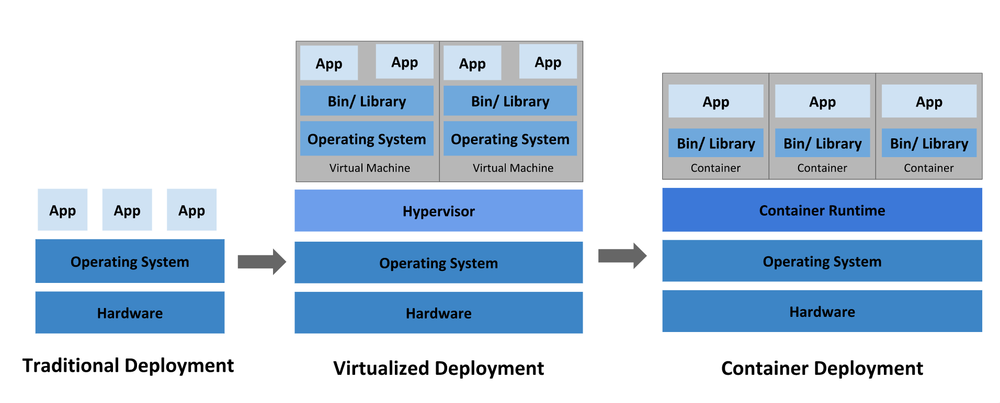
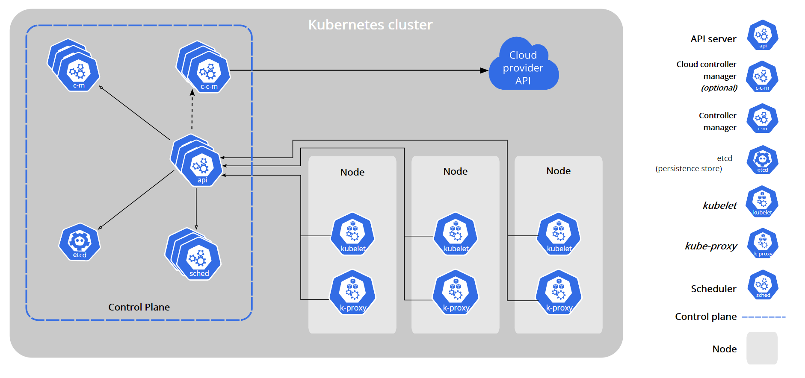
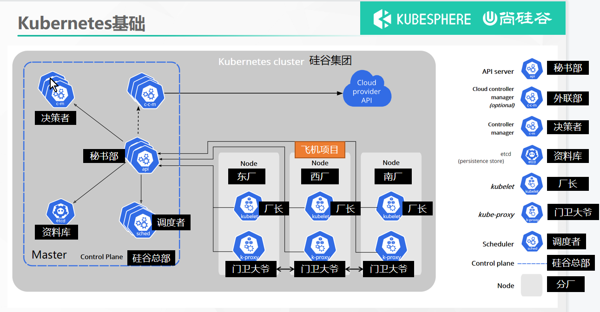
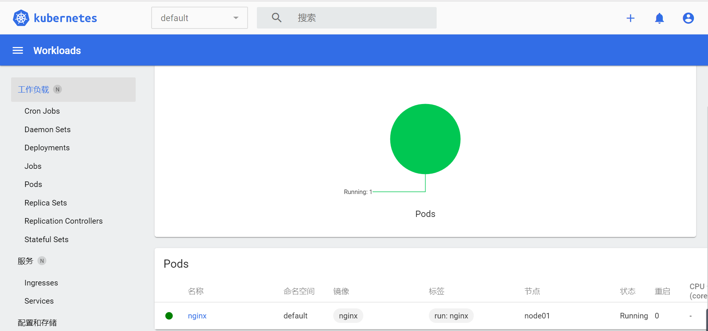

# 1、是什么 



> 我们急需一个大规模容器编排系统
>


kubernetes具有以下特性：

+ **服务发现和负载均衡**  
Kubernetes 可以使用 DNS 名称或自己的 IP 地址公开容器，如果进入容器的流量很大， Kubernetes 可以负载均衡并分配网络流量，从而使部署稳定。
+ **存储编排**  
Kubernetes 允许你自动挂载你选择的存储系统，例如本地存储、公共云提供商等。
+ **自动部署和回滚**  
你可以使用 Kubernetes 描述已部署容器的所需状态，它可以以受控的速率将实际状态 更改为期望状态。例如，你可以自动化 Kubernetes 来为你的部署创建新容器， 删除现有容器并将它们的所有资源用于新容器。
+ **自动完成装箱计算**  
Kubernetes 允许你指定每个容器所需 CPU 和内存（RAM）。 当容器指定了资源请求时，Kubernetes 可以做出更好的决策来管理容器的资源。
+ **自我修复**  
Kubernetes 重新启动失败的容器、替换容器、杀死不响应用户定义的 运行状况检查的容器，并且在准备好服务之前不将其通告给客户端。
+ **密钥与配置管理**  
Kubernetes 允许你存储和管理敏感信息，例如密码、OAuth 令牌和 ssh 密钥。 你可以在不重建容器镜像的情况下部署和更新密钥和应用程序配置，也无需在堆栈配置中暴露密钥。


_**<font style="color:#2F54EB;">Kubernetes 为你提供了一个可弹性运行分布式系统的框架。 Kubernetes 会满足你的扩展要求、故障转移、部署模式等。 例如，Kubernetes 可以轻松管理系统的 Canary 部署。</font>**_


# 2、架构


## 1、工作方式
Kubernetes **<font style="color:#F5222D;">Cluster </font>**= N **<font style="color:#F5222D;">Master</font>** Node + N **<font style="color:#F5222D;">Worker </font>**Node：N主节点+N工作节点； N>=1


## 2、组件架构


### 1、控制平面组件（Control Plane Components） 
控制平面的组件对集群做出全局决策(比如调度)，以及检测和响应集群事件（例如，当不满足部署的 `replicas` 字段时，启动新的 [pod](https://kubernetes.io/docs/concepts/workloads/pods/pod-overview/)）。

控制平面组件可以在集群中的任何节点上运行。 然而，为了简单起见，设置脚本通常会在同一个计算机上启动所有控制平面组件， 并且不会在此计算机上运行用户容器。 请参阅[使用 kubeadm 构建高可用性集群](https://kubernetes.io/zh/docs/setup/production-environment/tools/kubeadm/high-availability/) 中关于多 VM 控制平面设置的示例。

#### kube-apiserver
API 服务器是 Kubernetes [控制面](https://kubernetes.io/zh/docs/reference/glossary/?all=true#term-control-plane)的组件， 该组件公开了 Kubernetes API。 API 服务器是 Kubernetes 控制面的前端。

Kubernetes API 服务器的主要实现是 [kube-apiserver](https://kubernetes.io/zh/docs/reference/command-line-tools-reference/kube-apiserver/)。 kube-apiserver 设计上考虑了水平伸缩，也就是说，它可通过部署多个实例进行伸缩。 你可以运行 kube-apiserver 的多个实例，并在这些实例之间平衡流量。

#### etcd
etcd 是兼具一致性和高可用性的键值数据库，可以作为保存 Kubernetes 所有集群数据的后台数据库。

您的 Kubernetes 集群的 etcd 数据库通常需要有个备份计划。

要了解 etcd 更深层次的信息，请参考 [etcd 文档](https://etcd.io/docs/)。

#### kube-scheduler
控制平面组件，负责监视新创建的、未指定运行[节点（node）](https://kubernetes.io/zh/docs/concepts/architecture/nodes/)的 [Pods](https://kubernetes.io/docs/concepts/workloads/pods/pod-overview/)，选择节点让 Pod 在上面运行。

调度决策考虑的因素包括单个 Pod 和 Pod 集合的资源需求、硬件/软件/策略约束、亲和性和反亲和性规范、数据位置、工作负载间的干扰和最后时限。

#### kube-controller-manager
在主节点上运行 [控制器](https://kubernetes.io/zh/docs/concepts/architecture/controller/) 的组件。

从逻辑上讲，每个[控制器](https://kubernetes.io/zh/docs/concepts/architecture/controller/)都是一个单独的进程， 但是为了降低复杂性，它们都被编译到同一个可执行文件，并在一个进程中运行。

这些控制器包括:

+ 节点控制器（Node Controller）: 负责在节点出现故障时进行通知和响应
+ 任务控制器（Job controller）: 监测代表一次性任务的 Job 对象，然后创建 Pods 来运行这些任务直至完成
+ 端点控制器（Endpoints Controller）: 填充端点(Endpoints)对象(即加入 Service 与 Pod)
+ 服务帐户和令牌控制器（Service Account & Token Controllers）: 为新的命名空间创建默认帐户和 API 访问令牌

#### cloud-controller-manager
<font style="color:#222222;">云控制器管理器是指嵌入特定云的控制逻辑的 </font>[控制平面](https://kubernetes.io/zh/docs/reference/glossary/?all=true#term-control-plane)<font style="color:#222222;">组件。 云控制器管理器允许您链接集群到云提供商的应用编程接口中， 并把和该云平台交互的组件与只和您的集群交互的组件分离开。</font>

`cloud-controller-manager` 仅运行特定于云平台的控制回路。 如果你在自己的环境中运行 Kubernetes，或者在本地计算机中运行学习环境， 所部署的环境中不需要云控制器管理器。

与 `kube-controller-manager` 类似，`cloud-controller-manager` 将若干逻辑上独立的 控制回路组合到同一个可执行文件中，供你以同一进程的方式运行。 你可以对其执行水平扩容（运行不止一个副本）以提升性能或者增强容错能力。

下面的控制器都包含对云平台驱动的依赖：

+ 节点控制器（Node Controller）: 用于在节点终止响应后检查云提供商以确定节点是否已被删除
+ 路由控制器（Route Controller）: 用于在底层云基础架构中设置路由
+ 服务控制器（Service Controller）: 用于创建、更新和删除云提供商负载均衡器

### 2、Node 组件 
节点组件在每个节点上运行，维护运行的 Pod 并提供 Kubernetes 运行环境。

#### kubelet
一个在集群中每个[节点（node）](https://kubernetes.io/zh/docs/concepts/architecture/nodes/)上运行的代理。 它保证[容器（containers）](https://kubernetes.io/zh/docs/concepts/overview/what-is-kubernetes/#why-containers)都 运行在 [Pod](https://kubernetes.io/docs/concepts/workloads/pods/pod-overview/) 中。

kubelet 接收一组通过各类机制提供给它的 PodSpecs，确保这些 PodSpecs 中描述的容器处于运行状态且健康。 kubelet 不会管理不是由 Kubernetes 创建的容器。

#### kube-proxy
[kube-proxy](https://kubernetes.io/zh/docs/reference/command-line-tools-reference/kube-proxy/) 是集群中每个节点上运行的网络代理， 实现 Kubernetes [服务（Service）](https://kubernetes.io/zh/docs/concepts/services-networking/service/) 概念的一部分。

kube-proxy 维护节点上的网络规则。这些网络规则允许从集群内部或外部的网络会话与 Pod 进行网络通信。

如果操作系统提供了数据包过滤层并可用的话，kube-proxy 会通过它来实现网络规则。否则， kube-proxy 仅转发流量本身。



# 3、kubeadm创建集群
> 请参照以前Docker安装。先提前为所有机器安装Docker
>

## 1、安装kubeadm
+ 三台兼容的 Linux 主机。Kubernetes 项目为基于 Debian 和 Red Hat 的 Linux 发行版以及一些不提供包管理器的发行版提供通用的指令
+ 每台机器 2 GB 或更多的 RAM （如果少于这个数字将会影响你应用的运行内存)
+ 2 CPU 核或更多
+ 集群中的所有机器的网络彼此均能相互连接(公网和内网都可以)
    - **设置防火墙放行规则**
+ 节点之中不可以有重复的主机名、MAC 地址或 product_uuid。请参见[这里](https://kubernetes.io/zh/docs/setup/production-environment/tools/kubeadm/install-kubeadm/#verify-mac-address)了解更多详细信息。
    - **设置不同hostname**
+ VPC 不能使用 172.17 开头，因为 docker 已经占用了这个地址，需要避开，比如使用 172.31
+ 开启机器上的某些端口。请参见[这里](https://kubernetes.io/zh/docs/setup/production-environment/tools/kubeadm/install-kubeadm/#check-required-ports) 了解更多详细信息。
    - **内网互信**
+ 禁用交换分区。为了保证 kubelet 正常工作，你 **必须** 禁用交换分区。（使用 free -m 查看）
    - **永久关闭**


### 1、基础环境
> 所有机器执行以下操作
>

```bash
#各个机器设置自己的域名
hostnamectl set-hostname xxxx


# 将 SELinux 设置为 permissive 模式（相当于将其禁用）
sudo setenforce 0
sudo sed -i 's/^SELINUX=enforcing$/SELINUX=permissive/' /etc/selinux/config

#关闭swap
swapoff -a  
sed -ri 's/.*swap.*/#&/' /etc/fstab

#允许 iptables 检查桥接流量
cat <<EOF | sudo tee /etc/modules-load.d/k8s.conf
br_netfilter
EOF

cat <<EOF | sudo tee /etc/sysctl.d/k8s.conf
net.bridge.bridge-nf-call-ip6tables = 1
net.bridge.bridge-nf-call-iptables = 1
EOF
sudo sysctl --system

```


### 2、安装kubelet、kubeadm、kubectl

- kubelet：kubelet服务，组件架构中的kubelet
- kubeadm：集群引导工具
- kubectl：用户操作工具

```bash
cat <<EOF | sudo tee /etc/yum.repos.d/kubernetes.repo
[kubernetes]
name=Kubernetes
baseurl=http://mirrors.aliyun.com/kubernetes/yum/repos/kubernetes-el7-x86_64
enabled=1
gpgcheck=0
repo_gpgcheck=0
gpgkey=http://mirrors.aliyun.com/kubernetes/yum/doc/yum-key.gpg
   http://mirrors.aliyun.com/kubernetes/yum/doc/rpm-package-key.gpg
exclude=kubelet kubeadm kubectl
EOF


sudo yum install -y kubelet-1.20.9 kubeadm-1.20.9 kubectl-1.20.9 --disableexcludes=kubernetes

sudo systemctl enable --now kubelet
```

> kubelet 现在每隔几秒就会重启，因为它陷入了一个等待 kubeadm 指令的死循环
>


## 2、使用kubeadm引导集群


### 1、下载各个机器需要的镜像
```bash
sudo tee ./images.sh <<-'EOF'
#!/bin/bash
images=(
kube-apiserver:v1.20.9
kube-proxy:v1.20.9
kube-controller-manager:v1.20.9
kube-scheduler:v1.20.9
coredns:1.7.0
etcd:3.4.13-0
pause:3.2
)
for imageName in ${images[@]} ; do
docker pull registry.cn-hangzhou.aliyuncs.com/lfy_k8s_images/$imageName
done
EOF
   
chmod +x ./images.sh && ./images.sh
```


### 2、初始化主节点
```bash
#所有机器添加master域名映射，以下需要修改为自己的
echo "172.26.206.125  cluster-endpoint" >> /etc/hosts


#主节点初始化
kubeadm init \
--apiserver-advertise-address=172.26.206.125 \
--control-plane-endpoint=cluster-endpoint \
--image-repository registry.cn-hangzhou.aliyuncs.com/lfy_k8s_images \
--kubernetes-version v1.20.9 \
--service-cidr=10.96.0.0/16 \
--pod-network-cidr=192.168.0.0/16  # pod网络的范围域

#上列命令中所有网络范围不许重叠
```

出现以下提示则安装成功：

根据提示中的内容，依次执行其中的命令

然后使用不同的命令，将其他节点作为 **主节点 / 工作节点** 加入到k8s集群

```bash
Your Kubernetes control-plane has initialized successfully!

To start using your cluster, you need to run the following as a regular user:

  mkdir -p $HOME/.kube
  sudo cp -i /etc/kubernetes/admin.conf $HOME/.kube/config
  sudo chown $(id -u):$(id -g) $HOME/.kube/config

Alternatively, if you are the root user, you can run:

  export KUBECONFIG=/etc/kubernetes/admin.conf

You should now deploy a pod network to the cluster.
Run "kubectl apply -f [podnetwork].yaml" with one of the options listed at:
  https://kubernetes.io/docs/concepts/cluster-administration/addons/

You can now join any number of control-plane nodes by copying certificate authorities
and service account keys on each node and then running the following as root:

  kubeadm join cluster-endpoint:6443 --token dxlwb5.sp256jqy1ygnejsk \
    --discovery-token-ca-cert-hash sha256:900b7e39ccee36ee69481afb8ec6cce8b65437f9a1c1ba2fc38561ca745170c9 \
    --control-plane

Then you can join any number of worker nodes by running the following on each as root:

kubeadm join cluster-endpoint:6443 --token dxlwb5.sp256jqy1ygnejsk \
    --discovery-token-ca-cert-hash sha256:900b7e39ccee36ee69481afb8ec6cce8b65437f9a1c1ba2fc38561ca745170c9
```


### 3、根据提示继续
#### 1、设置.kube/config
```sh
#上面提示中的命令
mkdir -p $HOME/.kube
sudo cp -i /etc/kubernetes/admin.conf $HOME/.kube/config
sudo chown $(id -u):$(id -g) $HOME/.kube/config
```

```sh
#查看集群所有节点
> kubectl get nodes
NAME      STATUS     ROLES                  AGE   VERSION
hahhome   NotReady   control-plane,master   14m   v1.20.9
```


#### 2、安装网络组件
[calico官网](https://docs.projectcalico.org/getting-started/kubernetes/self-managed-onprem/onpremises#install-calico-with-kubernetes-api-datastore-more-than-50-nodes)

```bash
curl https://docs.projectcalico.org/v3.20/manifests/calico.yaml -O
# 如果下面查看pods状态如下，则使用v3.8版本
curl https://docs.projectcalico.org/v3.8/manifests/calico.yaml -O

kubectl apply -f calico.yaml
```

```sh
#查看集群部署了哪些应用？
docker ps   ===   kubectl get pods -A
# 运行中的应用在docker里面叫容器，在k8s里面叫Pod
> kubectl get pods -A
NAMESPACE     NAME                                       READY   STATUS              RESTARTS   AGE
kube-system   calico-kube-controllers-577f77cb5c-c4d8v   0/1     Pending             0          3m22s
kube-system   calico-node-8gffg                          0/1     Init:ErrImagePull   0          3m22s
kube-system   coredns-5897cd56c4-dprc5                   0/1     Pending             0          23m
kube-system   coredns-5897cd56c4-r6fxw                   0/1     Pending             0          23m
kube-system   etcd-hahhome                               1/1     Running             0          23m
kube-system   kube-apiserver-hahhome                     1/1     Running             0          23m
kube-system   kube-controller-manager-hahhome            1/1     Running             0          23m
kube-system   kube-proxy-qt4tc                           1/1     Running             0          23m
kube-system   kube-scheduler-hahhome                     1/1     Running             0          23m
```

当所有pod的STATUS都是**Running**时，master节点就准备就绪了

```sh
# 再次查看集群节点
> kubectl get nodes
NAME      STATUS   ROLES                  AGE   VERSION
hahhome   Ready    control-plane,master   77m   v1.20.9
```


### 4、加入node节点

虚拟机记得开放 6443 端口，VPC互通忽略

```bash
kubeadm join cluster-endpoint:6443 --token dxlwb5.sp256jqy1ygnejsk \
    --discovery-token-ca-cert-hash sha256:900b7e39ccee36ee69481afb8ec6cce8b65437f9a1c1ba2fc38561ca745170c9
```

在master执行以下命令查看集群状态：

```sh
kubectl get pods -A

# 当上面所有pods为Running时，worker节点就准备就绪了
kubectl get nodes
```


> 以上命令是24h过期，当过期后获取新令牌在master执行：
>
> kubeadm token create --print-join-command


> _**<font style="color:#F5222D;">高可用部署方式，也是在这一步的时候，使用添加主节点的命令即可</font>**_
>


### 6、部署dashboard
#### 1、部署
> kubernetes官方提供的可视化界面
>
> [https://github.com/kubernetes/dashboard](https://github.com/kubernetes/dashboard)

```bash
kubectl apply -f https://raw.githubusercontent.com/kubernetes/dashboard/v2.3.1/aio/deploy/recommended.yaml
```


```sh
> kubectl get pods -A
NAMESPACE              NAME                                         READY   STATUS    RESTARTS   AGE
kube-system            calico-kube-controllers-bcc6f659f-pj8gj      1/1     Running   0          17m
kube-system            calico-node-ww44h                            1/1     Running   0          17m
kube-system            coredns-5897cd56c4-dprc5                     1/1     Running   0          93m
kube-system            coredns-5897cd56c4-r6fxw                     1/1     Running   0          93m
kube-system            etcd-hahhome                                 1/1     Running   0          93m
kube-system            kube-apiserver-hahhome                       1/1     Running   0          93m
kube-system            kube-controller-manager-hahhome              1/1     Running   0          93m
kube-system            kube-proxy-qt4tc                             1/1     Running   0          93m
kube-system            kube-scheduler-hahhome                       1/1     Running   0          93m
kubernetes-dashboard   dashboard-metrics-scraper-79c5968bdc-mf9bn   1/1     Running   0          81s
kubernetes-dashboard   kubernetes-dashboard-658485d5c7-t7gwt        1/1     Running   0          81s
```


#### 2、设置访问端口
```bash
kubectl edit svc kubernetes-dashboard -n kubernetes-dashboard
```

> type: ClusterIP 改为 type: NodePort
>


```bash
> kubectl get svc -A |grep kubernetes-dashboard
kubernetes-dashboard   dashboard-metrics-scraper   ClusterIP   10.96.40.138   <none>        8000/TCP                 4m59s
kubernetes-dashboard   kubernetes-dashboard        NodePort    10.96.211.81   <none>        443:30411/TCP            4m59s
## 找到端口，在安全组放行
```


访问： https://集群任意IP:端口      https://47.120.12.106:30411

chrome不是私密连接的解决办法：点击高级，继续前往 / 或点击网页空白处，键盘输入thisisunsafe，回车


#### 3、创建访问账号
```yaml
#创建访问账号，准备一个yaml文件； vi dash-user.yaml
apiVersion: v1
kind: ServiceAccount
metadata:
  name: admin-user
  namespace: kubernetes-dashboard
---
apiVersion: rbac.authorization.k8s.io/v1
kind: ClusterRoleBinding
metadata:
  name: admin-user
roleRef:
  apiGroup: rbac.authorization.k8s.io
  kind: ClusterRole
  name: cluster-admin
subjects:
- kind: ServiceAccount
  name: admin-user
  namespace: kubernetes-dashboard
```

```bash
kubectl apply -f dash-user.yaml
```


#### 4、令牌访问

```bash
#获取访问令牌
kubectl -n kubernetes-dashboard get secret $(kubectl -n kubernetes-dashboard get sa/admin-user -o jsonpath="{.secrets[0].name}") -o go-template="{{.data.token | base64decode}}"
```


```json
eyJhbGciOiJSUzI1NiIsImtpZCI6IlJWemhWRWJnUFQxWW5QSkJtanJWY0hCSmcxV2N4ZHQ1ZTFyZVIwRnQ4N0UifQ.eyJpc3MiOiJrdWJlcm5ldGVzL3NlcnZpY2VhY2NvdW50Iiwia3ViZXJuZXRlcy5pby9zZXJ2aWNlYWNjb3VudC9uYW1lc3BhY2UiOiJrdWJlcm5ldGVzLWRhc2hib2FyZCIsImt1YmVybmV0ZXMuaW8vc2VydmljZWFjY291bnQvc2VjcmV0Lm5hbWUiOiJhZG1pbi11c2VyLXRva2VuLXJ3eGd0Iiwia3ViZXJuZXRlcy5pby9zZXJ2aWNlYWNjb3VudC9zZXJ2aWNlLWFjY291bnQubmFtZSI6ImFkbWluLXVzZXIiLCJrdWJlcm5ldGVzLmlvL3NlcnZpY2VhY2NvdW50L3NlcnZpY2UtYWNjb3VudC51aWQiOiJiNWU1YTU2Mi0zMzc2LTQxMjktYmI3OS1jMjNjNTM1NTc0NzIiLCJzdWIiOiJzeXN0ZW06c2VydmljZWFjY291bnQ6a3ViZXJuZXRlcy1kYXNoYm9hcmQ6YWRtaW4tdXNlciJ9.oFvtGYKFNiQrD-4aF0BpOtoU11jNNXLBd0aaNcLcbzjzlOHGJoiPfKPddJK38fTCOH63-zzR5aenDJPQNn6O0WlCp3O6w-getAIp6dBOaAkY1pMH7eRDNby9HsbmH-XFb6UTxxGpufc9i2OBLc9WsKwcZ59osPO6Kl0ChxCH0Omy8AHE79Nu2qrLSx1G89rkA2d9Be7d4kOCuOqUgRLG9-XtZDlBC9gNU_9hhJpRrDZRliocgzZTuRkosAn5tCQN4MPBXtsijyIMYSydOQ9-xhpGuJC1Dxz3xINqef8LJEcEk0VH7ERDAVMa4nmLyO5JQEv_oEoNWDIiTtQ8YIQPXQ
```


#### 5、界面



