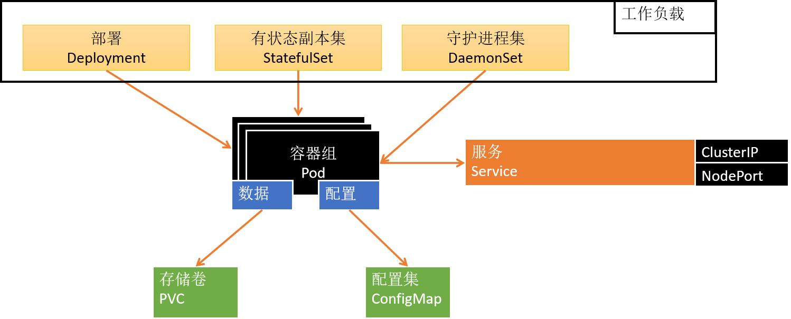
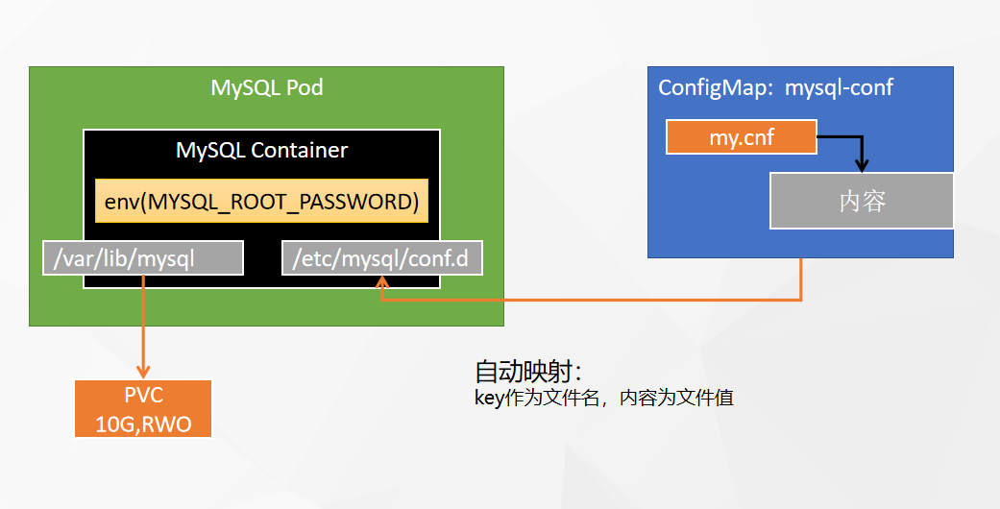
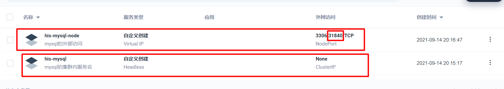
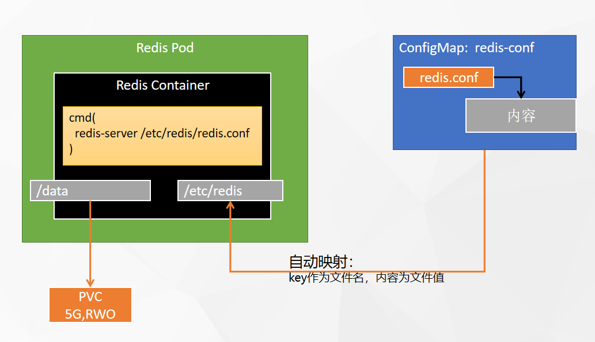
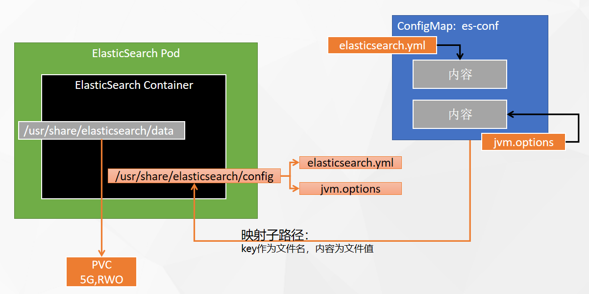

> 应用部署需要关注的信息【应用部署三要素】
>
> 1、应用的部署方式
>
> 2、应用的数据挂载（数据，配置文件）
>
> 3、应用的可访问性
>

# 


# 1、部署MySQL
## 1、mysql容器启动
```bash
docker run -p 3306:3306 --name mysql-01 \
-v /mydata/mysql/log:/var/log/mysql \
-v /mydata/mysql/data:/var/lib/mysql \
-v /mydata/mysql/conf:/etc/mysql/conf.d \
-e MYSQL_ROOT_PASSWORD=root \
--restart=always \
-d mysql:5.7 
```


## 2、mysql配置示例


```plain
[client]
default-character-set=utf8mb4
 
[mysql]
default-character-set=utf8mb4
 
[mysqld]
init_connect='SET collation_connection = utf8mb4_unicode_ci'
init_connect='SET NAMES utf8mb4'
character-set-server=utf8mb4
collation-server=utf8mb4_unicode_ci
skip-character-set-client-handshake
skip-name-resolve
```

## 3、mysql部署分析



> 1、集群内部，直接通过应用的  【服务名.项目名】 直接访问  
>
>         mysql -uroot -h**his-mysql-glgf.his** -p 
>
> 2、集群外部，
>
> 
>



# 2、部署Redis
## 1、redis容器启动
```bash
#创建配置文件
## 1、准备redis配置文件内容
mkdir -p /mydata/redis/conf && vim /mydata/redis/conf/redis.conf


##配置示例
appendonly yes
port 6379
bind 0.0.0.0


#docker启动redis
docker run -d -p 6379:6379 --restart=always \
-v /mydata/redis/conf/redis.conf:/etc/redis/redis.conf \
-v  /mydata/redis-01/data:/data \
 --name redis-01 redis:6.2.5 \
 redis-server /etc/redis/redis.conf
```


## 2、redis部署分析



# 3、部署ElasticSearch
## 1、es容器启动
```bash
# 创建数据目录
mkdir -p /mydata/es-01 && chmod 777 -R /mydata/es-01

# 容器启动
docker run --restart=always -d -p 9200:9200 -p 9300:9300 \
-e "discovery.type=single-node" \
-e ES_JAVA_OPTS="-Xms512m -Xmx512m" \
-v es-config:/usr/share/elasticsearch/config \
-v /mydata/es-01/data:/usr/share/elasticsearch/data \
--name es-01 \
elasticsearch:7.13.4

```

## 2、es部署分析


> 注意： 子路径挂载，配置修改后，k8s不会对其Pod内的相关配置文件进行热更新，需要自己重启Pod
>


# 4、应用商店
> 可以使用 dev-zhao 登录，从应用商店部署
>


# 5、应用仓库
> 使用企业空间管理员（wuhan-boss）登录，设置应用仓库
>

> 学习Helm即可，去helm的应用市场添加一个仓库地址，比如：bitnami
>


> 在这里，我们不涉及高可用部署相关内容。想了解详情，可以关注后续的课程，或者[大厂学苑](https://www.itdachang.com/) 《拥抱云原生》专题
>

