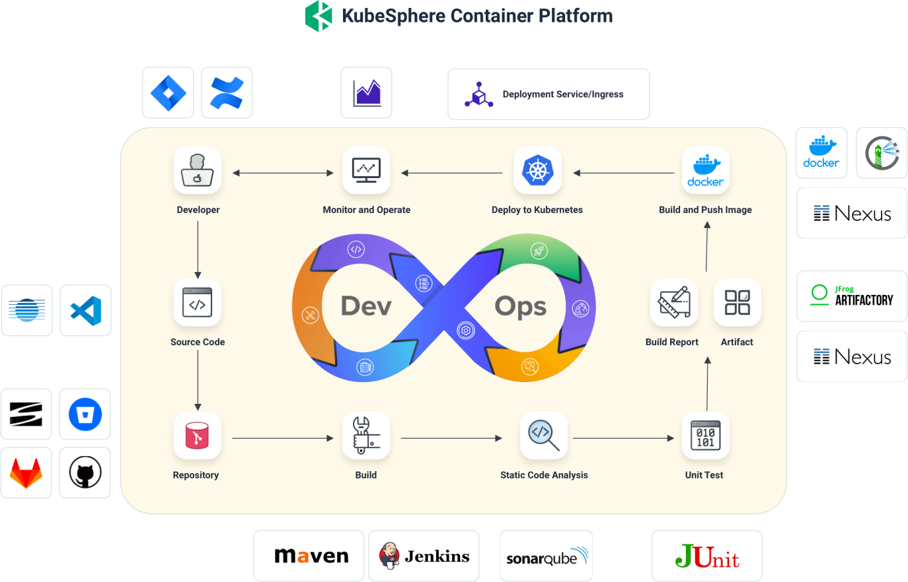
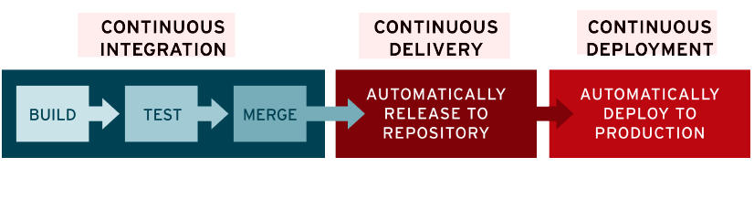

# 1、DevOps简介
DevOps **是一系列做法和工具**，可以使 IT 和软件开发团队之间的**流程实现自动化**。其中，随着敏捷软件开发日趋流行，**持续集成 (CI) **和**持续交付 (CD) **已经成为该领域一个理想的解决方案。在 CI/CD 工作流中，每次集成都通过自动化构建来验证，包括编码、发布和测试，从而帮助开发者提前发现集成错误，团队也可以快速、安全、可靠地将内部软件交付到生产环境。

 

# 2、DevOps落地
[https://kubesphere.com.cn/docs/devops-user-guide/understand-and-manage-devops-projects/overview/](https://kubesphere.com.cn/docs/devops-user-guide/understand-and-manage-devops-projects/overview/)

## 1、内置的Agent
[https://kubesphere.com.cn/docs/devops-user-guide/how-to-use/choose-jenkins-agent/](https://kubesphere.com.cn/docs/devops-user-guide/how-to-use/choose-jenkins-agent/)

